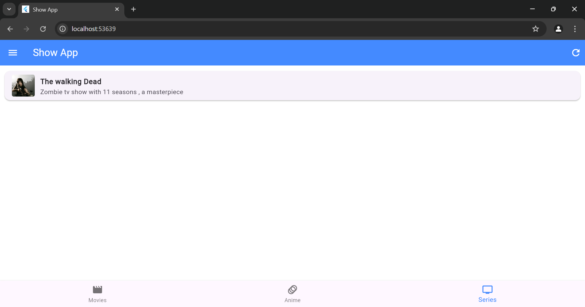
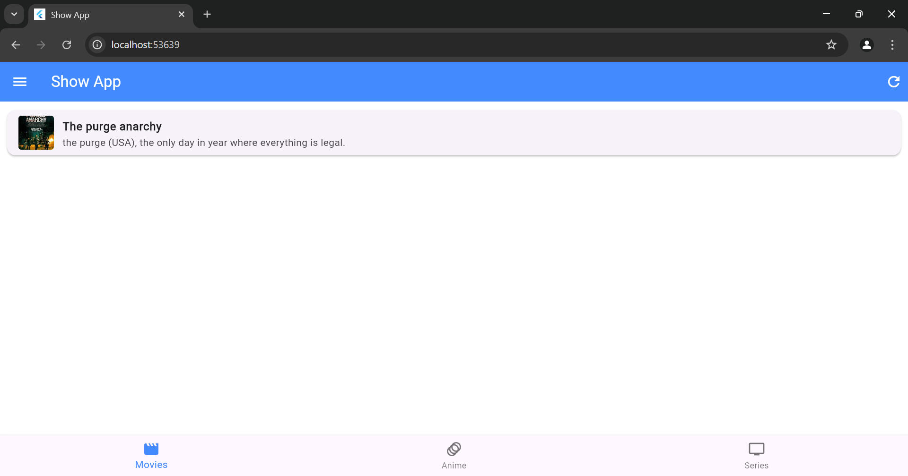
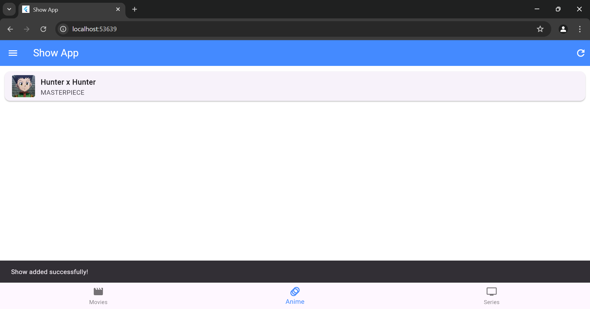
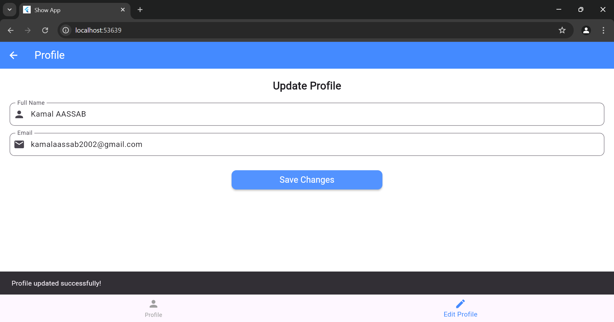
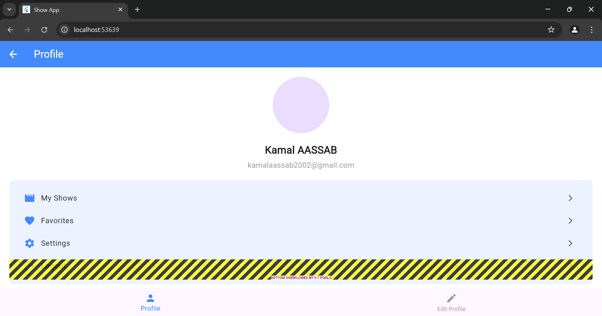
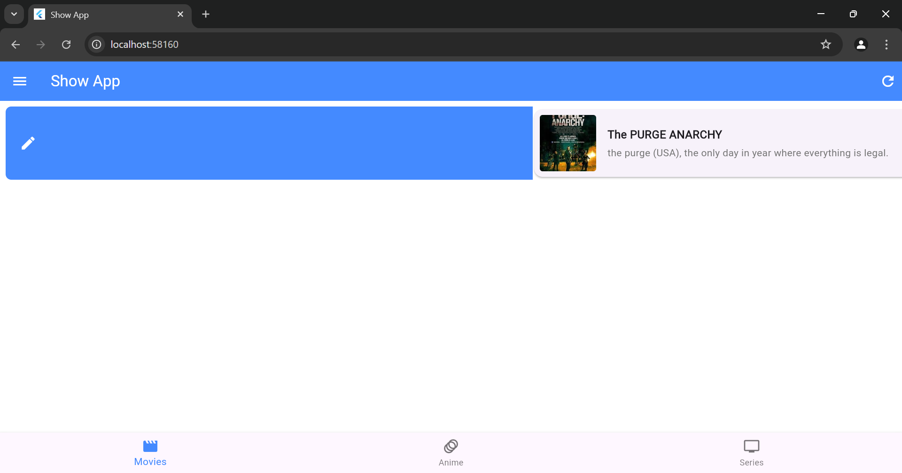
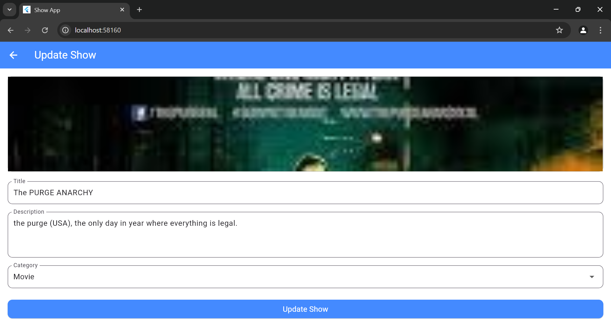
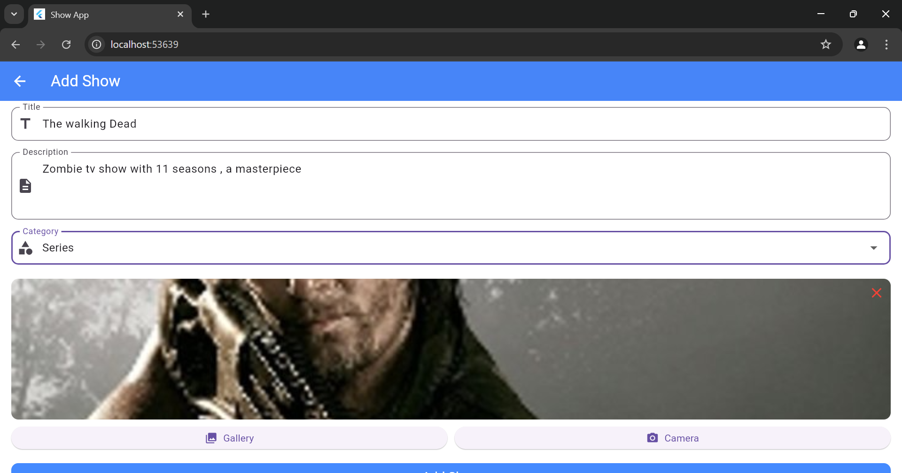

# ShowApp - Application de Gestion de Séries et Films

Une application Flutter pour gérer vos séries, films et animes préférés.

## 📱 Captures d'écran

### 🎬 Page d'accueil
<div style="display: flex; flex-wrap: wrap; gap: 20px; justify-content: center;">
  
  
  
</div>

### 👤 Gestion du profil
<div style="display: flex; flex-wrap: wrap; gap: 20px; justify-content: center;">
  
  
</div>

### ✏️ Modification d'un show
<div style="display: flex; flex-wrap: wrap; gap: 20px; justify-content: center;">
  
  
</div>

### ➕ Ajout d'un show
<div style="display: flex; flex-wrap: wrap; gap: 20px; justify-content: center;">
  
</div>

## ✨ Fonctionnalités

- 🔐 **Authentification utilisateur** avec stockage sécurisé du token
- 📱 **Interface responsive** et intuitive
- 🎭 **Gestion des catégories** (Films, Séries, Animes)
- ➕ **Ajout de shows** avec image, titre, description et catégorie
- ✏️ **Modification des shows** existants
- 🗑️ **Suppression de shows** avec confirmation
- 👤 **Gestion du profil** utilisateur
- 🔄 **Actualisation automatique** après chaque action

## 🛠️ Technologies Utilisées

- Flutter & Dart
- HTTP pour les requêtes API
- Shared Preferences pour le stockage local
- Provider pour la gestion d'état
- Support multi-plateforme (Web, Android, iOS)

## 🚀 Installation

1. Clonez le dépôt :
```bash
git clone https://github.com/KamalAassab/showapp-flutter.git
```

2. Installez les dépendances :
```bash
flutter pub get
```

3. Lancez l'application :
```bash
flutter run
```

## 📁 Structure du Projet

```
lib/
├── config/
│   └── api_config.dart
├── screens/
│   ├── add_show_page.dart
│   ├── home_page.dart
│   ├── login_page.dart
│   ├── profile_page.dart
│   └── update_show_page.dart
├── services/
│   └── auth_service.dart
└── main.dart
```

## 🤝 Contribution

Les contributions sont les bienvenues ! N'hésitez pas à :
1. Fork le projet
2. Créer une branche pour votre fonctionnalité
3. Commiter vos changements
4. Pousser vers la branche
5. Ouvrir une Pull Request

## 📄 Licence

Ce projet est sous licence MIT. Voir le fichier `LICENSE` pour plus de détails.

## 📧 Contact

Pour toute question ou suggestion, n'hésitez pas à ouvrir une issue sur GitHub.

---

## 🔐 **Connexion utilisateur** via l'API (authentification avec token JWT)
- 📄 **Affichage dynamique** des shows (classés par catégorie : films, animés, séries)
- ➕ **Ajout de show** (titre, description, catégorie, image)
- ✏️ **Mise à jour d'un show existant**
- ❌ **Suppression avec confirmation** (balayage latéral)
- 📸 **Sélection d'image** depuis la galerie ou l'appareil photo
- 🔄 **Rafraîchissement automatique** après chaque opération

---

## 🧱 Structure du Projet

```bash
.
├── backend/                # Backend Node.js + Express + SQLite
│   ├── server.js
│   ├── database.js
│   └── routes/
│       └── shows.js
├── flutter_app/            # Application Flutter
│   ├── lib/
│   │   ├── main.dart
│   │   ├── config/api_config.dart
│   │   ├── screens/
│   │   │   ├── login_page.dart
│   │   │   ├── home_page.dart
│   │   │   ├── profile_page.dart
│   │   │   ├── add_show_page.dart
│   │   │   └── update_show_page.dart
│   └── pubspec.yaml
